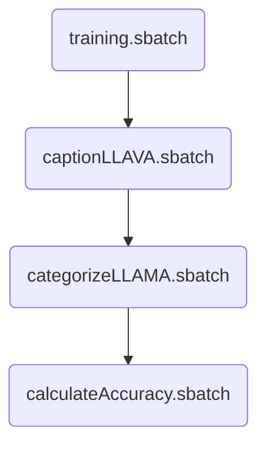

# SLURM

> [!WARNING]
> You'll need to change the cd directory in these slurm scripts to run on your own.

> [!NOTE]
> For any other customizations, change the scripts called by the slurm scripts.

```
-rw-r--r--. 1 imo2d domain users  658 Jan 20 21:59 calculateAccuracy.sbatch
-rw-r--r--. 1 imo2d domain users  688 Jan 20 18:20 captionLLAVA.sbatch
-rw-r--r--. 1 imo2d domain users  688 Jan 20 18:49 categorizeLLAMA.sbatch
-rw-r--r--. 1 imo2d domain users 1109 Dec 30 11:27 dependencies.sbatch
-rw-r--r--. 1 imo2d domain users  609 Jan 20 15:49 training.sbatch
```

Slurm is _weird_ to deal with - ChatGPT works well with it though... (It helped get all of these scripts started :) )

These aren't perfect, but they helped me a lot:

- <https://hpcdocs.hpc.arizona.edu/running_jobs/batch_jobs/intro/#batch-script-structure>
- <https://hpcdocs.hpc.arizona.edu/running_jobs/batch_jobs/submitting_jobs/>
- <https://hpcdocs.hpc.arizona.edu/running_jobs/monitoring_jobs_and_resources/>



## calculateAccuracy.sbatch

- Figure out how accurate our LLAMA classifcations were

## captionLLAVA.sbatch

- Caption our images using a finetuned LLAVA model

## categorizaLLAMA.sbatch

- Peform a final classification based on our LLAVA captions

## dependencies.sbatch

- This is old - don't use?

## training.sbatch

- Finetune a LLAVA model
